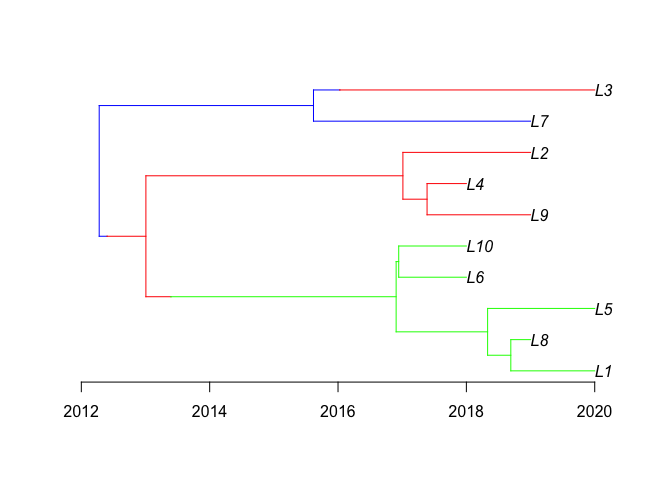
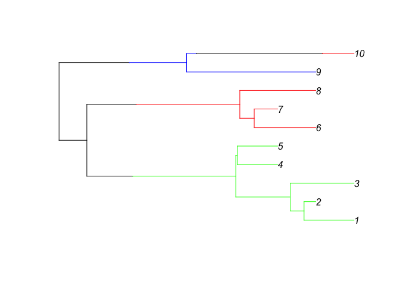
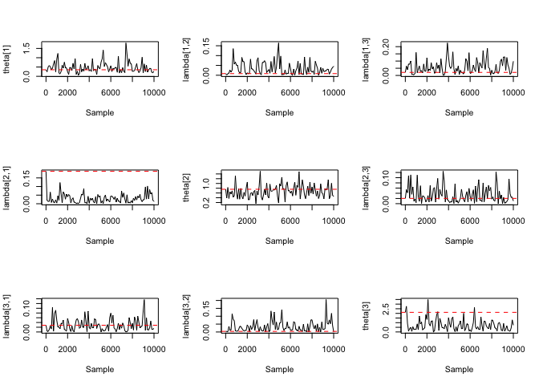
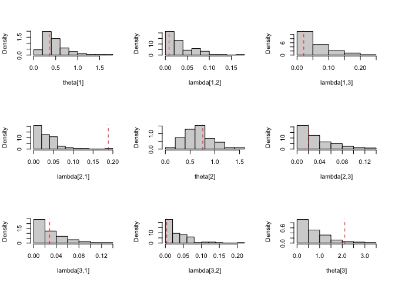

# StructCoalescent

<!-- badges: start -->
<!-- badges: end -->

The goal of StructCoalescent is to perform Bayesian inference using the
exact structured coalescent model.

## Installation

You can install StructCoalescent from [GitHub](https://github.com/)
with:

``` r
if ( !require( devtools, quietly = TRUE ) ){
  install.packages("devtools")
}
devtools::install_github("IanPRoberts/StructCoalescent")
set.seed(1000)
```

The package can then be loaded using:

``` r
library(StructCoalescent)
```

## Example

This is a basic example of usage. First, we sample a heterochronous
dated structured phylogenetic tree with $n=10$ leaves obtained from from
$d=3$ demes between 2015 and 2020.

``` r
n <- 10
d <- 3
leaf_data <- cbind('Leaf_ID'=paste0('L', 1:n),
                   'Leaf_age'=sample(2018:2020, n, TRUE),
                   'Leaf_deme'=sample(1:d, n, TRUE))
coalescent_rates <- rexp(d, 1)
migration_matrix <- matrix(rexp(d^2, 20), d, d); diag(migration_matrix) <- 0


strphylo <- rstrphylo(n, d, coalescent_rates, migration_matrix, leaf_data)
plot(strphylo, time_axis=TRUE, root_time=strphylo$root.age, show.tip.label=TRUE)
```

 Our
simulated phylogeny is returned as an object of class `strphylo` which
can be passed directly into our MCMC algorithm as an initialisation
point. Alternatively, we illustrate how to convert between a `strphylo`
phylogeny and a BEAST-annotated Newick string using the `treeio`
package.

A `strphylo` phylogeny can be converted to a Newick string via a
treedata object as follows,

``` r
treedata <- treeio::as.treedata( strphylo )
newick_string <- treeio::write.beast.newick( treedata )
```

resulting in a Newick string

    #> (((((((L1[&type=2]:1.307570019,L8[&type=2]:0.3075700191)[&type=2]:0.3614643143,L5[&type=2]:1.669034333)[&type=2]:1.425505973,(L6[&type=2]:1.054246555,L10[&type=2]:1.054246555)[&type=2]:0.04029375171)[&type=2]:3.50854755)[&type=1]:0.390826112,((L9[&type=1]:1.612581503,L4[&type=1]:0.6125815034)[&type=1]:0.3764541975,L2[&type=1]:1.989035701)[&type=1]:4.004878268)[&type=1]:0.6040162555)[&type=3]:0.1235585534,(L7[&type=3]:3.382411688,(L3[&type=1]:3.971524459)[&type=3]:0.410887229)[&type=3]:3.33907709)[&type=3];

We can then return from the annotated Newick string (with demes
annotated by type) to our original `strphylo` object as follows

``` r
treedata <- treeio::read.beast.newick(
  textConnection( newick_string )
)
strphylo <- as.strphylo( treedata )
```

Note that we require `textConnection()` here to allow our Newick string
(stored as a character vector) to be passed as a file connection into
`read.beast.newick()`. Alternatively, a Newick string can be passed in
from an external file using the path to the file.

Now that we have a structured phylogeny in `strphylo` format to use for
initialisation, we identify the prior parameters for use in our MCMC. To
use our default prior distributions, we can either omit all prior
parameters from our MCMC,

``` r
# NOT RUN
StructCoalescent_mcmc(N=1e4, strphylo, coalescent_rates, migration_matrix, stdout_log=FALSE, thin=100, proposal_rates=c(20, 1, 1))
```

or we can pass prior parameters into the MCMC using in a mode-variance
parameterisation of a Gamma distribution

``` r
prior_parameters <- default_priors( strphylo, n_deme = 3, M = fitch( strphylo )$min_migs )
```

    #>     cr_shape      cr_rate      cr_mode       cr_var     mm_shape      mm_rate 
    #>  1.000000000  2.256252677  0.000000000  0.443212770  1.000000000 31.546311630 
    #>      mm_mode       mm_var 
    #>  0.000000000  0.001004854

``` r
# NOT RUN
StructCoalescent_mcmc(N=1e4, strphylo, coalescent_rates, migration_matrix,
                      cr_mode = 0, cr_var = 0.443212770,
                      mm_mode = 0, mm_var = 0.001004854,
                      stdout_log=FALSE, thin=100, proposal_rates=c(20, 1, 1))
```

MCMC output consists of three files (by default added to current working
directory `getwd()`):

- `StructCoalescent.trees` contains a thinned MCMC sample of dated
  structured phylogenies in a BEAST meta-commented Newick format, which
  can be read with `treeio::read.beast`.
- `StructCoalescent.log` contains a thinned MCMC sample of evolutionary
  parameters, likelihood evaluations and the current radius of the
  subtree in a csv format, which can be read with `read.csv`
- `StructCoalescent.freq` contains details of the total number of
  accepted proposals of each type as well as the total number of
  attempted proposals of that type.

We can present a sample of migration histories using a consensus
migration history, with sections of the branch assigned a deme provided
a proportion $p$ of sampled migration histories observe the same deme at
that position as follows:

``` r
strphylo_list <- lapply(treeio::read.beast('./StructCoalescent.trees'), as.strphylo)
consensus_strphylo <- exact_consensus(strphylo_list, consensus_prob=0.75)
```



Evolutionary parameter samples can be presented in a variety of ways
including trace plots and histograms:

### Trace plots

``` r
StructCoalescent_log <- read.csv('./StructCoalescent.log',
                                 header=TRUE)
layout(matrix(1:d^2, d, d))
for (col_id in 1:d){
  for (row_id in 1:d){
    if (col_id == row_id){
      col_name <- paste0('coal_rate_', col_id)
      title <- list(paste0('theta[', col_id, ']'))
      true_param <- coalescent_rates[col_id]
    } else{
      col_name <- paste('backward_migration_rate', row_id, col_id, sep='_')
      title <- paste0('lambda[', row_id, ',', col_id, ']')
      true_param <- migration_matrix[row_id, col_id]
    }
    plot(StructCoalescent_log$sample, StructCoalescent_log[,col_name], type='l', xlab='Sample', ylab=title)
    abline(h=true_param, lty=2, col='red')
  }
}
```



### Histograms

``` r
StructCoalescent_log <- read.csv('./StructCoalescent.log',
                                 header=TRUE)
layout(matrix(1:d^2, d, d))
for (col_id in 1:d){
  for (row_id in 1:d){
    if (col_id == row_id){
      col_name <- paste0('coal_rate_', col_id)
      title <- list(paste0('theta[', col_id, ']'))
      true_param <- coalescent_rates[col_id]
    } else{
      col_name <- paste('backward_migration_rate', row_id, col_id, sep='_')
      title <- paste0('lambda[', row_id, ',', col_id, ']')
      true_param <- migration_matrix[row_id, col_id]
    }
    hist(StructCoalescent_log[,col_name], xlab=title, freq=FALSE, main='')
    abline(v=true_param, lty=2, col='red')
  }
}
```


